# 1.1 Лабораторная работа: начало работы с микроконтроллером
## 1.1.1 Описание практикума
### Цели работы
Рассмотреть оборудование, которое мы будем использовать в дальнейшем, а так же разобрать код простейшей программы.

Мы будем работать с готовыми модулями микроконтроллера STM32 - это наиболее популярное и широко используемое за счет низкой стоимости семейство микроконтроллеров, используемых и в реальной жизни, а не только в обучении. Программирование будет происходить на языке C.

В Arduino можно быстро и легко выполнить базовые задачи. Но есть и существенные недостатки: за счет абстрагирования и упрощения порога вхождения, выпадают некоторые важные вещи. Например, нас приучают писать весь алгоритм программы в бесконечном цикле и щедро снабжать код задержками, тогда как в профессиональной embedded-разработке это делается через прерывания и многопоточность. Кроме того, историческая привязка проекта Arduino к микроконтроллерам Atmel делает решения на ней слабо масштабируемыми в силу высокой стоимости контроллеров. Тогда как решение-прототип на STM32 потом можно без труда перенести в реальное устройство, и оно будет бюджетным.

Мы будем изучать в нашем курсе несколько более современные (хотя и более сложные в освоении) программные платформы. Предлагается ARM Mbed - официальная платформа производителя (ARM), по синтаксису приближенная к Arduino, но с гораздо более широкими возможностями и более правильным стилем программирования.

* Вот пример того, как выглядит самая простая программа на Mbed

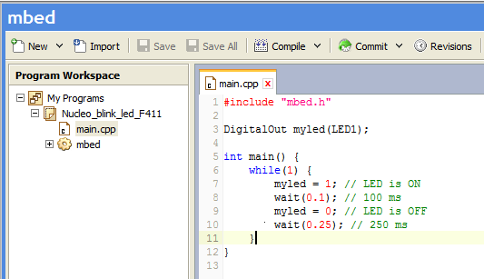

Вот краткая информация по плате STM32Nucleo

### STM32Nucleo

Это стандартная учебная плата от ST на настоящий момент. В магазинах есть большой выбор таких плат с разными характеристиками микроконтроллера, некоторые из них неудобны из-за малого количества памяти.

Плюсы:

* Форм-фактор Arduino
* Есть встроенный USB-UART (интерфейс для коммуникации платы и компьютера через консольный ввод/вывод)
* Легко доступна в продаже
* Очень удобно перепрошивать: определяется как флэшка, поэтому на нее достаточно просто "бросить" файл, и это работает и в Linux, и в Windows
* Совместима с Mbed "из коробки"

Минусы:

* Много различных версий с разными характеристиками (легко запутаться)
* Устаревший разъём MiniUSB (хотя, у него есть и преимущество: такой разъём сложнее сломать)

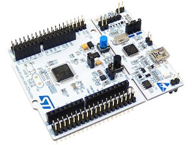

## 1.1.2 Hello World — компиляция и загрузка программы

Для этого задания понадобятся:

* Плата STM32Nucleo

Для работы с Mbed в самом начале нам не понадобится даже устанавливать IDE - можно воспользоваться онлайновой средой разработки. Для этого просто выбераем пункт Compiler на главной странице.


Для работы с онлайн-IDE нам понадобится создать и подтвердить аккаунт на сайте Mbed. Это тоже удобно: наши программы будут сохраняться в облаке.

Потом мы перейдем на оффлайновую IDE под названием Mbed Studio, об этом чуть далее: на первых этапах она нам не понадобится.

Программа для печати приветствия в терминал  есть в стандартном наборе Mbed. Откроем ее. Правый клик слева на списке программ, и выбираем "Новая программа":

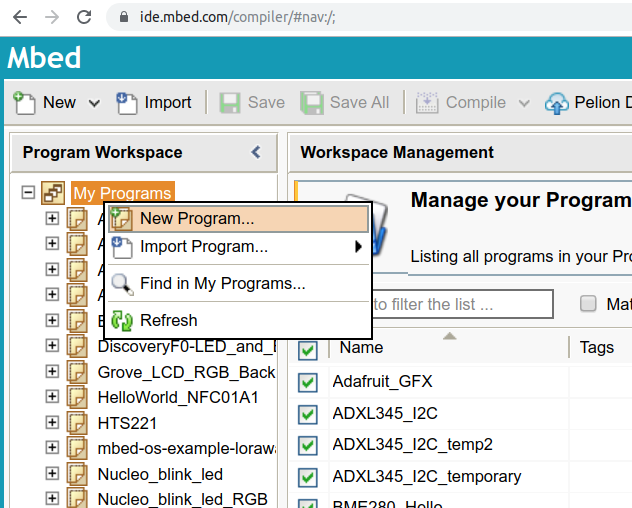

Появится диалог создания новой программы либо выбора из шаблона. Пока не будем смотреть шаблоны, а попробуем создать с нуля пустую программу.

Создаем в проекте новый файл и называем его main.cpp, как принято. Проект будет выглядеть следующим образом:

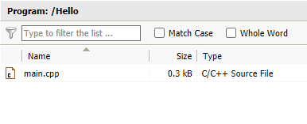

И редактируем файл main.cpp. Текст программы очень прост. Она печатает в консоль и мигает светодиодом. Пока не будем разбираться, как она устроена, а просто используем ее в готовом виде:

```C
#include "mbed.h"

DigitalOut led(LED1);
int main()
{    
    int i = 0;
    printf("Hello World !\n");
    while(1)     {
        wait_ms(1000); // 1 second
        led = !led; // Toggle LED
        printf("This program runs since %d seconds.\n", i++);    
    }
}
```

Остается скомпилировать программу и скачать готовую прошивку. Но прежде нужно выбрать правильный тип платы. Вверху справа:

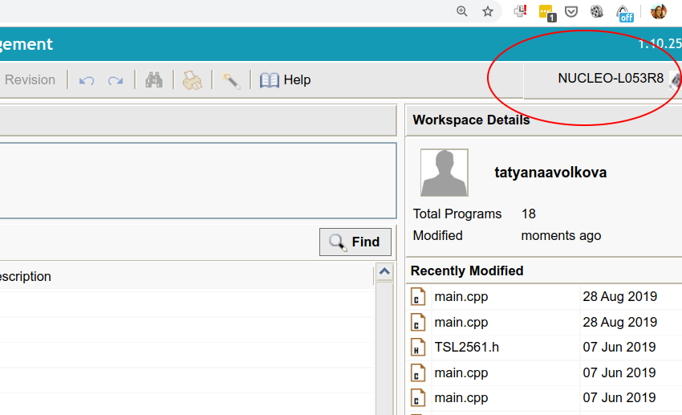

Если нажать, откроется диалоговое окно с выбором платы из числа часто используемых, либо можно добавить новую плату. Нужно выбрать именно ту, которая у нас. Для примера, на скриншоте используется STM32 Nucleo L053R8.

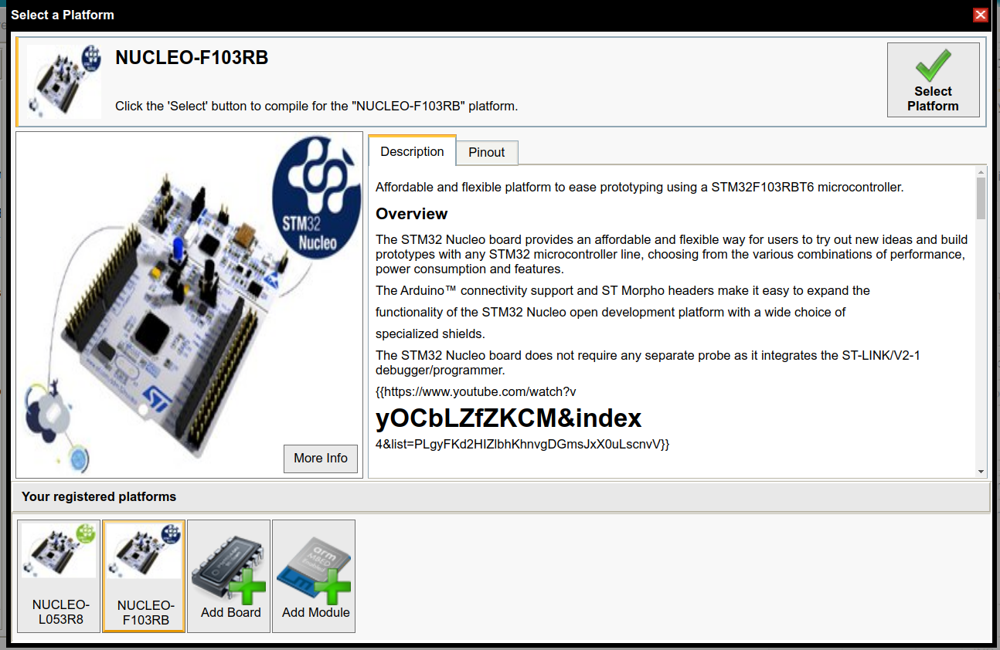

Наконец, нажимаем Compile. С первого раза эта программа у вас не скомпилируется, поскольку в проекте не хватает библиотек. Поэтому нужно нажать правой кнопкой на проекте и выбрать пункт Import Library, далее From Import Wizard.

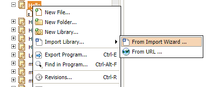

Откроется wisard. Набираем в поиске mbed:

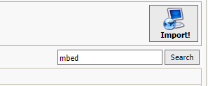

И выбираем первый же результат - библиотеку с названием mbed. После чего жмем кнопку Import!

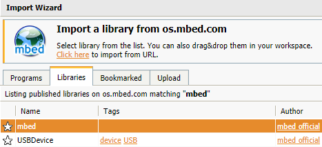

Результат: библиотека добавлена в проект и отображается шестеренкой

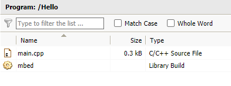

После чего можно просто скомпилировать и скачать программу:

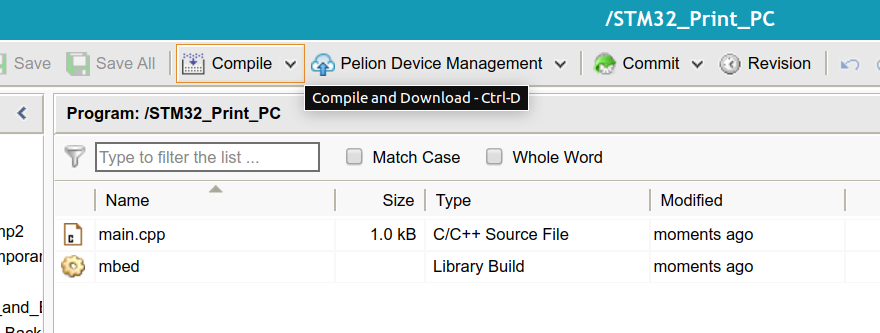

Теперь надо подключить устройство через MiniUSB-кабель. Устройство должно появиться у нас в системе как флэшка. Получившуюся прошивку просто бросаем на появившуюся в системе флэшку. Плата будет мигать красно-зеленым светодиодом, а потом перестанет - это означает, что прошивка загрузилась.

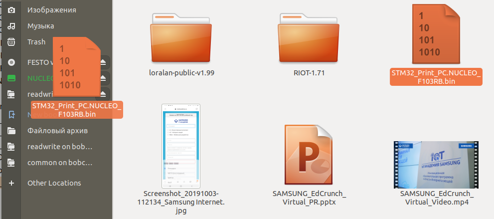

Результат: плата будет мигать встроенным светодиодом раз в секунду! Теперь можно поменять период мигания на свое усмотрение.


## 1.1.3 Подключение терминала

Помимо мигания светодиодом, в коде прописан еще и вывод текста в терминал. Проверим, как это работает.

Для этого задания понадобится:

* Плата STM32Nucleo


Как узнать номер порта, где находится плата? В Linux нужно посмотреть в папке /dev/, там появится новое устройство, скорее всего с именем /dev/ttyACM0 или /dev/ttyUSB0. В Windows вы смотрите номер порта в Диспетчере устройств, в данном случае это оказался порт номер 8:

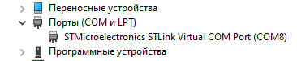

Для коммуникации с устройством нужна терминальная программа. Для Windows годятся Putty, Termite и другие. Для Linux практически единственный удобный клиент с графическим интерфейсом - это GTKTerm

Чтобы установить и запустить GTKTerm:
```C
sudo apt-get install gtkterm
sudo gtkterm
```
Далее надо указать параметры соединения - COM-порт - выбираем из выпадающего списка, и скорость (бод) 9600

Теперь мы видим окно терминала, на котором идет отсчет времени от старта программы.


## 1.1.4 Разбираем код демо-примера

Теперь, когда всё заработало, разберем исходный код подробно
```C
#include "mbed.h"

DigitalOut led(LED1);
int main()
{
    int i = 0;
    printf("Hello World !\n");
    while(1) 
    {
        wait_ms(1000); // 1 second
        led = !led; // Toggle LED
        printf("This program runs since %d seconds.\n", i++);
    }
}
```
С первой строкой: #include "mbed.h" всё понятно. Мы подключаем библиотеку, как вы обычно подключали stdio или iostream в других языках

Далее строчка DigitalOut led(LED1); - в этой строке создается переменная led, в качестве параметра ей в конструктор передается LED1 - это не что иное, как макрос, отсылающий к выводу микроконтроллера, к которому на плате подключен встроенный в плату светодиод. Вместо LED1 можно подставить название любого другого вывода - например, PA_8, и сигнал уже будет отправляться на этот вывод. Класс DigitalOut, объектом которого является led - это класс для работы с выводами, настроенными как выходы. 

Дальше начинается main() и в самом начале заводится переменная int i = 0 - она будет использоваться для подсчета, сколько секунд прошло с начала программы. Для проверки первый раз печатается Hello World. Затем начинается бесконечный цикл. 

wait_ms(1000);  означает ждать заданное число миллисекунд, led = !led; - переключение переменной в противоположное значение на каждой итерации, и затем печать - сколько раз произошел инкремент счетчика. Программа никогда не завершает свою работу и крутится в бесконечном цикле. Такой стиль написания программы, когда весь код пишется в бесконечном цикле, очень характерен для платформы Arduino, но строго говоря, он неправильный. Мы здесь сейчас рассматриваем этот пример только потому, что он очень просто устроен.

Давайте изменим период мигания.
```C
#include "mbed.h"

DigitalOut led(LED1);
int main()
{
    int i = 0;
    printf("Hello World !\n");
    while(1) 
    {
        wait_ms(100); // 0.1 second
        led = !led; // Toggle LED
        printf("This program runs since %d seconds.\n", i++);
    }
}
```

Теперь диод мигает 10 раз в секунду.