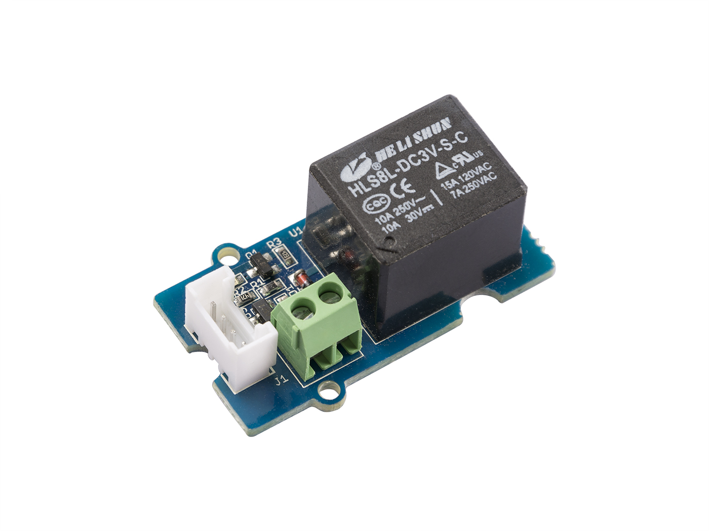
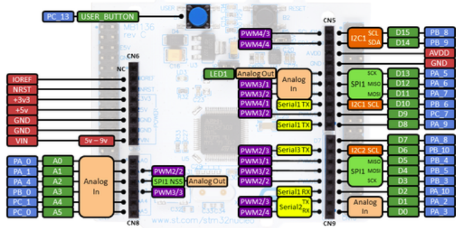

# 1.2 Лабораторная работа: входы и выходы микроконтроллера
## 1.2.1 Управление внешним устройством на примере реле
### Цели работы
Научиться подключать модули(кнопка) через плату-переходник,подключённую к плате STM32Nucleo.Научиться работать с ШИМ и встроенными параметрами платы.

Эта работа будет происходить с GPIO (General Purpose Input/Output — порты ввода-вывода общего назначения). GPIO позволяют соединять микроконтроллер с внешними устройствами по максимально простому интерфейсу: наличие либо отсутствие сигнала.

Задача: пощелкать не встроенным светодиодом, а внешним реле, подключенным к плате.
Для этого задания понадобятся:

* Плата STM32Nucleo


* Плата-переходник Grove Base Shield


* Модуль реле от Grove



У микроконтроллера на учебной отладочной плате есть достаточно много свободных выводов.Свободные выводы можно конфигурировать и использовать как:

* выходы (отправлять на них “высокий” или “низкий” логический уровень, то есть устанавливать напряжение 3,3 В или сбрасывать в ноль)
* входы (считывать их состояние)

Важное пояснение: не все выводы можно задействовать. К примеру, выводы D0 и D1 задействовать не рекомендуется, так как они уже заняты отладочной консолью. D0, D1 и так далее пронумерованы так только на самой плате (маленькие номера у каждого вывода). Выводы же с точки зрения микроконтроллера называются иначе - они сгруппированы в порты (PORT, или просто P), и в рамках каждого порта пронумерованы (например, PA_6, на плате этот вывод подписан как 12).




Подключение реле будет через плату-переходник Grove Base Shield,через порт D6.
```C++
#include "mbed.h"
DigitalOut relay(D6);
int on = 1,off = 0;
int main()
{
 
    while(1) {
        relay = on;
        wait(1);
        relay = off;
        wait(1);
    }
}
```
## 1.2.2 Считывание нажатия кнопки

Для этого задания понадобятся:

* Плата STM32Nucleo


Далее предоставлен пример кода,который позволяет считать нажатие кнопки. Для него понадобится только плата Nucleo, а считывать нажатие будет происходить у встроенной в плату синей кнопки(USER_BUTTON).
```C
#include "mbed.h"
 
DigitalIn mybutton(USER_BUTTON);
DigitalOut myled(LED1);

int main()
{
    mybutton.mode(PullUp);

    while(1) {
        printf("Button state is: %d\n\r", mybutton.read());

        if (mybutton == 0) { // Button is pressed

            myled = !myled; // Toggle the LED state
            wait_ms(200); // 200 ms
        }
    }
}
```


## 1.2.3 Выдача ШИМ-сигнала с платы

Для управления яркостью светодиода будет использоваться широтно-импульсная модуляция(ШИМ). Это означает, что вместо непрерывной подачи напряжения это происходит с перерывами, за счет чего общая яркость свечения будет ниже. Перерывов человеческий глаз не заметит, поскольку будет очень большая скорость переключения.

Для этого задания понадобится:

* Плата STM32Nucleo


В mbed всё, что касается ШИМ, инкапсулировано в библиотеке PwmOut.
Пример кода:
```C
#include "mbed.h"

PwmOut PWM1(LED1);

int main()
{
    PWM1.period(0.010); // set PWM period to 10 ms
    PWM1=0.5; // set duty cycle to 50%
}
```

Пример для управления яркостью светодиода с клавиатуры:

```C
#include "mbed.h"

PwmOut led(LED1);
float brightness=0.0;

int main()
{
    printf("Control of LED dimmer by host terminal\n\r");
    printf("Press 'u' = brighter, 'd' = dimmer\n\r");

    while(1) {
        char c = getc();
        wait(0.001);
        if((c == 'u') && (brightness < 0.1)) {
            brightness += 0.001;
            led = brightness;
        }

        if((c == 'd') && (brightness > 0.0)) {
            brightness -= 0.001;
            led = brightness;
        }
        printf("%c %1.3f \n \r",c,brightness);
    }
}
```


## 1.2.4 Подключение кнопки
Для этого задания понадобится:

* Плата STM32Nucleo


* Плата-переходник Grove Shield


* Кнопочный модуль от Grove


Для выполнения задания Кейса понадобится клавиатурный модуль. Он устроен чрезвычайно просто, и подойдет от любого производителя.


Работа с этим модулем совершенно аналогична работе с одной кнопкой, за одним исключением: в модуль уже впаяны подтягивающие резисторы, поэтому включать их в коде явным образом не нужно.Создаётся режим PullNone, чтобы это обозначить и не задействовать встроенный подтягивающий резистор.

Пример считывания нажатия кнопки на порте D7.
```C
#include "mbed.h"

DigitalIn mybutton(D7);
DigitalOut myled(LED1);

int main() {

  mybutton.mode(PullNone);

  while(1) {

    printf("Button state is: %d\n\r", mybutton.read());

    if (mybutton == 0) { // Button is pressed

      myled = !myled; // Toggle the LED state
      wait(0.2); // 200 ms
    }
  }
}
```
