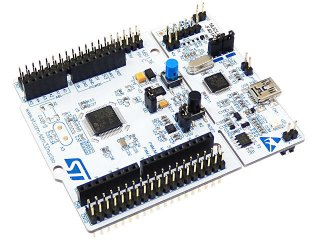

# 1.3 Практикум: Задача Кейса 1
### Цели работы
Попрактиковаться, и закрепить знания полученные в предыдущих работах кейса

Имеется помещение с дверью, закрытой на электронный замок. Этот замок открывается по введению кода на четырехкнопочной клавиатуре. Устройство должно обладать визуальной индикацией. Пока дверь закрыта, горит светодиод. После нажатия кнопки, дверь открывается и остается открытой в течение 10 секунд, все это время светодиод мигает. После чего дверь закрывается и светодиод опять светится непрерывно.
Для имитации замка, будем пользоваться реле.
Для этого задания понадобятся:

* Плата STM32Nucleo



* Плата-переходник Grove Base Shield


* Модуль реле от Grove


```C++
#include "mbed.h"
DigitalOut relay(D6);
DigitalOut led(LED1);
DigitalIn mybutton(USER_BUTTON);

int w = 0;
int main()
{
 
    while(1) {
	if (!led){
		led = !led;
	}
	if (mybutton == 0){
		relay = !relay;
		while (w < 50){
			led = !led;
			w++;
			wait (0.2);
		}
		relay = !relay;
		w = 0;
		if (!led){
			led = !led;
		}
	}
    }
}
```
