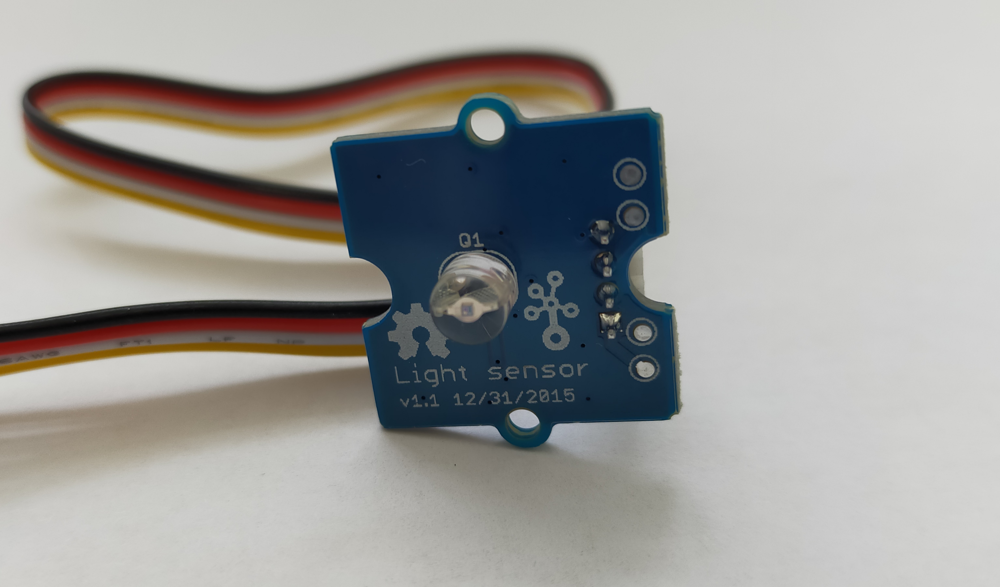
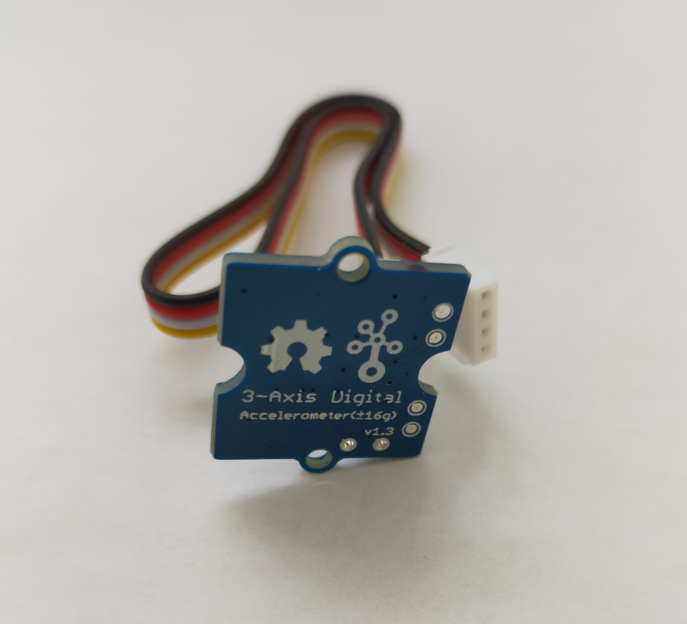
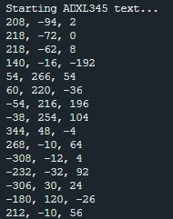

## 2.1. Лабораторная работа: знакомимся с сенсорами

### 2.1.1. Метеодатчик

В связи с отсутствием на момент выполнения работы метеодатчика, было принято решение заменить его на световой сенсор. 
Необходимое оборудование: Световой сенсор



Интерфейс подключения: Аналоговый

***Код программы:***

main.cpp:
```cpp
#include "mbed.h"

AnalogIn light_sensor(PA_1);

int main()
{
	float res;
	while (true) {
		res = light_sensor.read()*100;
		printf("%2.2f\n",res);
		thread_sleep_for(1000);
	}
}
```
***Результат работы программы:***


После запуска программы в консоль выводятся строки, показывающие уровень освещения в пределах от 0 до 100.
В данной лабораторной работе возникла проблема с выводом значений типа float. Для ее исправления необходимо зайти в файл mbed_lib.json и изменить в блоке «minimal-printf-enable-floating-point» значение «value» с false на true.


### 2.1.2. Акселерометр

Необходимое оборудование: отладочная плата акселерометра на основе ADXL345.



Интерфейс подключения: I2C
[Библиотека](https://os.mbed.com/users/peterswanson87/code/ADXL345_I2C/file/d9412b56f98a/ADXL345_I2C.h/)


***Код программы:***

main.cpp:
```cpp
#include "mbed.h"
#include "ADXL345_I2C.h"

ADXL345_I2C accelerometr(I2C_SDA,I2C_SCL);

int main()
{
	int readings[3] = {0,0,0};
	printf("Starting ADXL345 text...\n");
	accelerometr.setPowerControl(0x00);
	accelerometr.setDataFormatControl(0x0B);
	accelerometr.setDataRate(ADXL345_3200HZ);
	accelerometr.setPowerControl(0x08);

	while(1){
		thread_sleep_for(1000);
		accelerometr.getOutput(readings);
		printf("%i, %i, %i\n",(int16_t)readings[0],(int16_t)readings[1],(int16_t)readings[2]);
	}
}
```
***Результат работы программы:***



После запуска программы в консоль выводятся строки, показывающие угол наклона акселерометра по трем осям по отношению к земной поверхности.

### 2.1.3. Дальномер

В связи с отсутствием на момент выполнения работы отладочной платы дальномера на основе VL6180, было принято решение заменить ее на ультразвуковой дальномер Grove Ultrasonic Ranger.
Необходимое оборудование: дальномер Grove Ultrasonic Ranger.


Интерфейс подключения: Аналоговый
[Библиотека](https://os.mbed.com/users/NickRyder/code/RangeFinder/)


***Код программы:***

main.cpp:
```cpp
#include "mbed.h"
#include "RangeFinder.h"

RangeFinder rf(PA_1,10,5000,100000);

int main()
{
	float d;
	while(1){
		d =rf.read_m();
		if(d ==-1.0){
			printf("Timeout Error.\n");
		}else if(d >5.0){
			printf("No objects within detection range.\n");
		}else{
			printf("Distance = %f m.\n",d);
		}
		thread_sleep_for(500);
	}
}
```
***Результат работы программы:***


После запуска программы в консоль выводятся строки, показывающие расстояние до объектов.