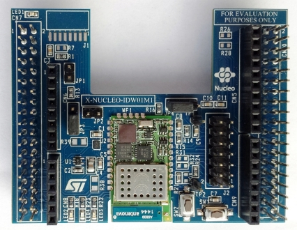

## Лабораторная работа 2.3. RTOS на примере Mbed OS
### Цель работы
Познакомиться с RTOS используя в качестве примерера Mbed OS

### 2.3.2 Таймеры
В Mbed есть простой таймер для вызова функции с определенной периодичностью. Он называется Ticker.

Пример программы:
main_1.cpp:
```C++
    #include "mbed.h"
	Ticker toggle_led_ticker;
	DigitalOut led1(LED1);
	void toggle_led()
	{
		led1 = !led1;
	}

	int main()
	{
		// Init the ticker with the address of the function (toggle_led) to be           attached and the interval (100 ms)
		toggle_led_ticker.attach(&toggle_led, 0.1);
		while (true) {
			// Do other things...
		}
	}
```
Мы заводим объект класса Ticker, и привязываем (attach) срабатывание функции toggle_led каждые 100 миллисекунд. Синтаксис очень похож на JavaScript и иные языки, в которых есть абстракция таймера. 
После компиляции увидим быстро (10 раз в секунду) мигающий светодиод.

### 2.3.2 Потоки
Модифицируем нашу программу так, чтобы она мигала светодиодом в отдельном потоке. Тогда вызов будет неблокирующий, и программа сможет делать что-то ещё помимо мигания светодиодом.
Посмотрим на самый простой пример программы с двумя потоками. Здесь создается объект класса "Поток" (Thread). Получается, что в программе участвуют два потока: один (основной поток программы) мигает светодиодом, а другой (новый, который мы завели) печатает символы.

Пример программы:
main_2.cpp:
```C++
    #include "mbed.h"
	void print_char(char c = '*')
	{
		printf("%c", c);
		fflush(stdout);
	}

	Thread thread;

	DigitalOut led1(LED1);

	void print_thread()
	{
		while (true) {
			wait(1);
			print_char();
		}
	}

	int main()
	{
		printf("\n\n*** RTOS basic example ***\n");
		thread.start(print_thread);
		while (true) {
			led1 = !led1;
			wait(0.5);
		}
	}
```
### 2.3.4 Кнопка + Прерывание
Загрузим следующий пример кода. При удерживании кнопки User Button (это синяя кнопка на Nucleo) мигание будет происходить быстрее.

Пример программы:
main_3.cpp:
```C++
	#include "mbed.h"

	InterruptIn button(USER_BUTTON);
	DigitalOut led(LED1);

	double delay = 0.5; // 500 ms
	void pressed()
	{
		delay = 0.1; // 100 ms
	}

	void released()
	{
		delay = 0.5; // 500 ms
	}

	int main()
	{
	// Assign functions to button
		button.fall(&pressed);
		button.rise(&released);
		while (1) {
			led = !led;
			wait(delay);
		}
	}
```
### 2.3.5 Устраняем дребезг контактов
Можно заметить, что когда мы нажимаем кнопку - иногда происходят ложные срабатывания. Например, вы нажали кнопку однократно, а программа выдает, что было несколько нажатий кнопки. Это известная проблема, называемая “дребезг контактов”. Ее причина в том, что механические контакты кнопки за счет упругости материала колеблются еще некоторое время после того, как вы уже отпустили кнопку, и поэтому регистрируются ложные нажатия. Бороться с этой проблемой можно на физическом уровне (разные кнопки выдают разный дребезг, зависит от их качества исполнения), но чаще всего ее решают программным образом.

Пример программы:
main_4.cpp:
```C++
	#include "mbed.h"

	DigitalOut led1(LED1);

	InterruptIn button1(USER_BUTTON);
	volatile bool button1_pressed = false; // Used in the main loop
	volatile bool button1_enabled = true; // Used for debouncing
	Timeout button1_timeout; // Used for debouncing

	// Enables button when bouncing is over
	void button1_enabled_cb(void)
	{
		button1_enabled = true;
	}

	// ISR handling button pressed event
	void button1_onpressed_cb(void)
	{
		if (button1_enabled) { // Disabled while the button is bouncing
			button1_enabled = false;
			button1_pressed = true; // To be read by the main loop
			button1_timeout.attach(callback(button1_enabled_cb), 0.3); // Debounce time 300 ms
		}
	}

	int main()
	{
		//button1.mode(PullUp); // Activate pull-up
		button1.fall(callback(button1_onpressed_cb)); // Attach ISR to handle button press event

		int idx = 0; // Just for printf below

		while(1) {
			if (button1_pressed) { // Set when button is pressed
				button1_pressed = false;
				printf("Button pressed %d\n", idx++);
				led1 = !led1;
			}
		}
	}
```