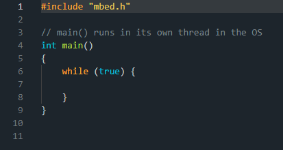
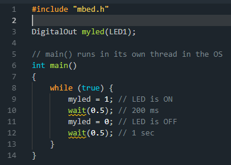
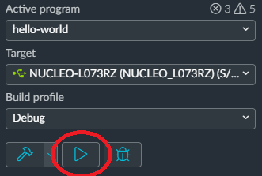

## 2.4. Лабораторная работа: начинаем работать в Mbed Studio
### 2.4.1. Введение
Mbed Studio существует для Windows, Mac и Linux, скачивается по адресу:[https://os.mbed.com/studio/](https://os.mbed.com/studio/)

У этой среды множество возможностей:
- Полноценный компилятор от ARM
- Пошаговая отладка
- Автоопределение подключенной платы
- Загрузка программы прямо из IDE
- Контроль версий
- Окно терминала для коммуникации с платой
- Менеджмент устройств (об этом будет далее)
Но есть и свои недостатки:
- Малая библиотека стандартных примеров по сравнению с онлайн-средой. Но зато и примеры выбраны только самые важные, и в них не запутаешься
- Общая недоработанность среды (версия для Linux вышла совсем недавно), встречаются баги
- Самое главное: медленная компиляция! В онлайн-компиляторе, как ни странно, всё работает гораздо быстрее. Авторы называют в качестве причины то, что он работает на мощной распределенной серверной системе. Поэтому в учебных целях предпочтителен именно онлайновый компилятор для быстрой сборки и изменения примеров. Для серьезной разработки, где вы больше работаете с кодом и вам нужны все вышеупомянутые фичи, больше подойдет как раз офлайновая IDE.
- Несмотря на указанные минусы, ознакомиться с Mbed Studio стоит, чтобы знать, чем пользоваться в случае, если нужен дебаггинг или более серьезная работа с кодом.

Установка не вызывает трудностей. Если вы работаете в Linux, то установка будет выглядеть так:
```
sudo chmod +x ./MbedStudio-0.9.1.sh
./MbedStudio-0.9.1.sh
```
Возможно, в процессе понадобится доустановить недостающие библиотеки.
Программа выглядит так:

Можно создать пустой проект, либо выбрать один из готовых примеров.


### 2.4.2. Пример с миганием светодиода
Попробуем сделать новую программу. Выбираем File - New Program. Тип программы выбираем “empty Mbed OS program”, называем программу как угодно.


Вам по умолчанию сделают самый простой пустой main:



Давайте попробуем здесь простейшую “Мигалку”. Модифицируйте код согласно уже известной вам программе:



Функция wait выделяется желтым как предупреждение. Она по-прежнему работает, но ее не рекомендуется использовать. В дальнейшем будет сказано, как делать задержку корректнее, а пока можно собрать программу и с ней.

Сборка и загрузка программы не вызывает трудностей. Выберите в Target конкретную модель вашей платы. Дальше назначение кнопок понятно: молоток - компиляция, стрелочка - загрузка программы в плату, жучок - отладка. Соберите вашу первую программу нажатием на “молоток”. 


Пусть вас не смущает долгое время компиляции: происходит сборка всех вспомогательных библиотек, при дальнейших сборках этого же проекта всё будет гораздо быстрее. По итогам сборки увидите внизу лог:


Теперь ничто не мешает загрузить программу в плату нажатием на “треугольник”. 



### 2.4.3. Как правильно делать “мигалку”
Теперь, раз вы уже знаете, как работать с потоками, запустите “правильную” мигалку в правильном стиле. Рассмотрите пример под названием mbed-os-example-blinky


Код достаточно понятен: основной поток программы засыпает на 500 миллисекунд, после чего переключает светодиод

### 2.4.4. Советы и замечания
1.Если работаете с несколькими проектами, то не забывайте указывать, какой из них активен в настоящий момент, нажатием правой кнопки мыши на проекте и выбором Set Active Program


2.Если среда не предлагает выбор цели и не дает скомпилировать программу, то скорее всего, она занята обновлением библиотек mbed. Среда так устроена, что она всегда стремится держать библиотеки в актуальном состоянии, и пока они не подгрузятся, ничего работать в принципе не будет.

3.На настоящий момент замечен баг - иногда не открывается терминал последовательного порта. Он должен автоматически открываться, но этого не происходит в некоторых случаях. Решение здесь простое - использовать внешний терминал при необходимости.

4.Проблема, похоже, связанная с п.2. - иногда не появляется кнопки “загрузка” - среда не распознает подключенную плату. В этом случае у вас всегда остается вариант загрузки программы через файловый менеджер, бросанием ее на подключенную “флэшку”. Ваши программы хранятся в папке Mbed Programs в домашней директории, и там всегда можно взять файл .bin.