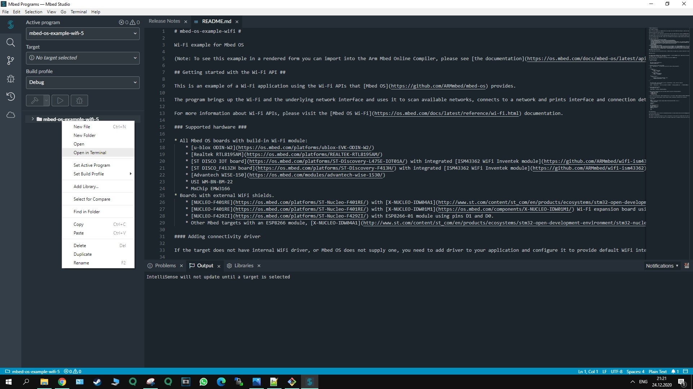
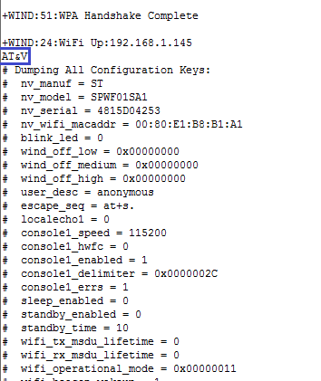
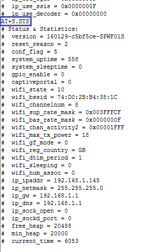
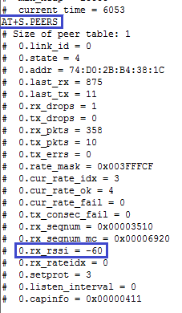

# 3.1 Лабораторная работа: Начинаем работу с Wi-Fi модулем
## 3.1.1 Необходимое оборудование
* Плата idw01m1

* Плата STM32Nucleo

* Провод USB для подключения

* Mbed studio для ввода команд

* Точка WIFI с доступом в интернет

## 3.1.2 Коммуникация через последовательный порт, AT команды
Запускаем терминал 

* AT+S.SSIDTXT=NAMESSID (Имя точки доступа)
* AT+S.SCFG=wifi_wpa_psk_text,MYPASSWORD (пароль доступа)
* AT+S.SCFG=wifi_priv_mode,2 (тип шифрования, в данный момент WPA-Personal (TKIP/AES) or WPA2-Personal (TKIP/AES))
* AT+S.SCFG=wifi_mode,1 (режим работы – подключение к точке доступа)
* AT+S.SCFG=ip_use_dhcp,1 (тип адреса – получать будем по DHCP)
* AT&W (сохранение настроек в энергонезависимой памяти)
* AT+CFUN=1 (перезагрузка в режим 1)

Если всё введено верно, то после перезагрузки модуль подключится к сети и точка доступа ему присвоит IP-адрес.
Также при загрузке модуль нам напишет ещё некоторую информацию, в том числе я выделил версию прошивки|

## 3.1.3. Обновление прошивки платы

Самая новая версия прошивки - перейдите на сайт и скачайте ее(http://wiki.amperka.ru/%D0%B1%D1%8B%D1%81%D1%82%D1%80%D1%8B%D0%B9-%D1%81%D1%82%D0%B0%D1%80%D1%82:nucleo
). 
На приведенной картинке самая новая прошивка

После установки перезагрузите компьютер.

## 3.1.4. Примеры AT-команд

Давайте теперь посмотрим ещё какую-нибудь информацию из модуля.

Посмотрим конфигурацию с помощью команды "AT&V"

Информации много, поэтому я всю показывать не стал, увидите сами. В том числе мы видим здесь mac-адрес модуля.

Теперь посмотрим статусы с помощью команды "AT+S.STS"

Здесь мы также видим версию прошивки и уже MAC-адрес точки доступа

Запросим ещё некоторую важную информацию по работе модуля в сети Wi-Fi с помощью команды "AT+S.PEERS"

Одним из немаловажных параметров мы видим уровень сигнала от точки доступа в децибелах (выделено синим прямоугольником)

