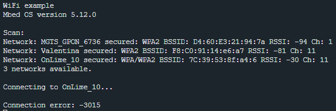

## 3.2. Лабораторная работа. Wi-Fi в Mbed

### Цель работы

Требуется написать программу для связи платы с сетью wifi и получения данных по сети.

### Ход выполнения работы

В примере рассматривается плата «idw01m1».


Сначала нужно открыть пример для Wifi в Mbed Studio, 


Далее в директории проекта нужно открыть файл mbed_app.json


В структуре проекта видно, что в нем фигурирует набор json-файлов:
* mbed_app.json
* mbed_app_esp8266.json
* mbed_app_idw01m1.json
* mbed_app_idw04a1.json

Первый файл - конфигурационный, в нем задаются параметры подключения, такие как имя и пароль сети, интерфейс, свойства этого интерфейса (к примеру, выводы для коммуникации). Другие файлы - это примеры настроек для различных WiFi- интерфейсов. Если вы используете какой-то из этих интерфейсов, то копируете настройки в mbed_app.json - именно к нему будет обращаться программа.
Далее ставим библиотеки для «idw01m1» (https://github.com/ARMmbed/wifi-x-nucleo-idw01m1), подключаем «idw01m1» к плате Nucleo, компилируем пример и загружаем в плату. 
После запуска платы происходит следующее: вначале появляется надпись Scan, затем появляется список доступных сетей. Далее мы видим процесс подключения.



После подключения выводится следующее сообщение.


***Код прогаммы:***

Mbed_app.json:

```json
{
	"config": {
		"wifi-ssid": {
			"help": "WiFi SSID",
			"value": "\"ustu_open\""
		},
		"wifi-password": {
			"help": "WiFi Password",
			"value": "\"\""
		}
	},
	"target_overrides": {
		"*": {
			"platform.stdio-convert-newlines": true,
			"idw0xx1.expansion-board": "IDW01M1",
			"idw0xx1.provide-default": true,
			"idw0xx1.tx": "PA_9",
			"idw0xx1.rx": "PA_10",
			"drivers.uart-serial-txbuf-size": 512,
			"drivers.uart-serial-rxbuf-size": 512
		}
	}
}
```
main.cpp:
```cpp
#include "mbed.h"
#include "SpwfSAInterface.h"
#include "BlockExecuter.h"
#include "MQTTmbed.h"
#include "MQTTClientMbedOs.h"

WiFiInterface *wifi;

const char *sec2str(nsapi_security_t sec)
{
    switch (sec) {
        case NSAPI_SECURITY_NONE:
            return "None";
        case NSAPI_SECURITY_WEP:
            return "WEP";
        case NSAPI_SECURITY_WPA:
            return "WPA";
        case NSAPI_SECURITY_WPA2:
            return "WPA2";
        case NSAPI_SECURITY_WPA_WPA2:
            return "WPA/WPA2";
        case NSAPI_SECURITY_UNKNOWN:
        default:
            return "Unknown";
    }
}

int scan_demo(WiFiInterface *wifi)
{
    WiFiAccessPoint *ap;

    printf("Scan:\n");

    int count = wifi->scan(NULL,0);

    if (count <= 0) {
        printf("scan() failed with return value: %d\n", count);
        return 0;
    }

    /* Limit number of network arbitrary to 15 */
    count = count < 15 ? count : 15;

    ap = new WiFiAccessPoint[count];
    count = wifi->scan(ap, count);

    if (count <= 0) {
        printf("scan() failed with return value: %d\n", count);
        return 0;
    }

    for (int i = 0; i < count; i++) {
        printf("Network: %s secured: %s BSSID: %hhX:%hhX:%hhX:%hhx:%hhx:%hhx RSSI: %hhd Ch: %hhd\n", ap[i].get_ssid(),
               sec2str(ap[i].get_security()), ap[i].get_bssid()[0], ap[i].get_bssid()[1], ap[i].get_bssid()[2],
               ap[i].get_bssid()[3], ap[i].get_bssid()[4], ap[i].get_bssid()[5], ap[i].get_rssi(), ap[i].get_channel());
    }
    printf("%d networks available.\n", count);

    delete[] ap;
    return count;
}

int main()
{
    printf("WiFi example\n");

#ifdef MBED_MAJOR_VERSION
    printf("Mbed OS version %d.%d.%d\n\n", MBED_MAJOR_VERSION, MBED_MINOR_VERSION, MBED_PATCH_VERSION);
#endif

    wifi = WiFiInterface::get_default_instance();
    if (!wifi) {
        printf("ERROR: No WiFiInterface found.\n");
        return -1;
    }

    int count = scan_demo(wifi);
    if (count == 0) {
        printf("No WIFI APs found - can't continue further.\n");
        return -1;
    }

    printf("\nConnecting to %s...\n", MBED_CONF_APP_WIFI_SSID);
    int ret = wifi->connect(MBED_CONF_APP_WIFI_SSID, MBED_CONF_APP_WIFI_PASSWORD, NSAPI_SECURITY_WPA_WPA2);
    if (ret != 0) {
        printf("\nConnection error: %d\n", ret);
        return -1;
    }

    printf("Success\n\n");
    printf("MAC: %s\n", wifi->get_mac_address());
    printf("IP: %s\n", wifi->get_ip_address());
    printf("Netmask: %s\n", wifi->get_netmask());
    printf("Gateway: %s\n", wifi->get_gateway());
    printf("RSSI: %d\n\n", wifi->get_rssi());

    wifi->disconnect();

    printf("\nDone\n");
}
```
