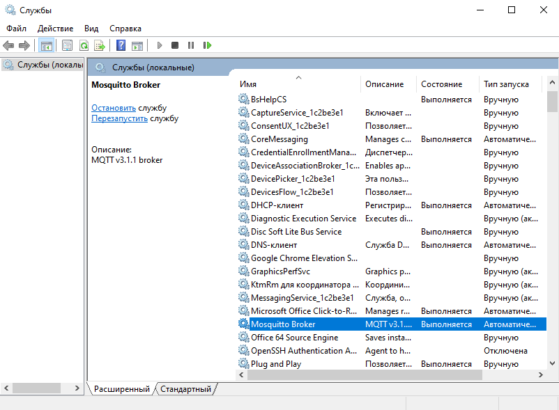
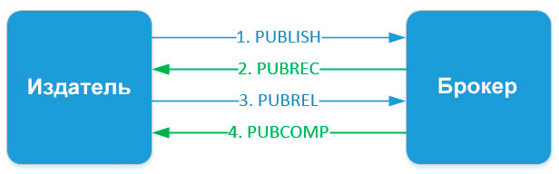
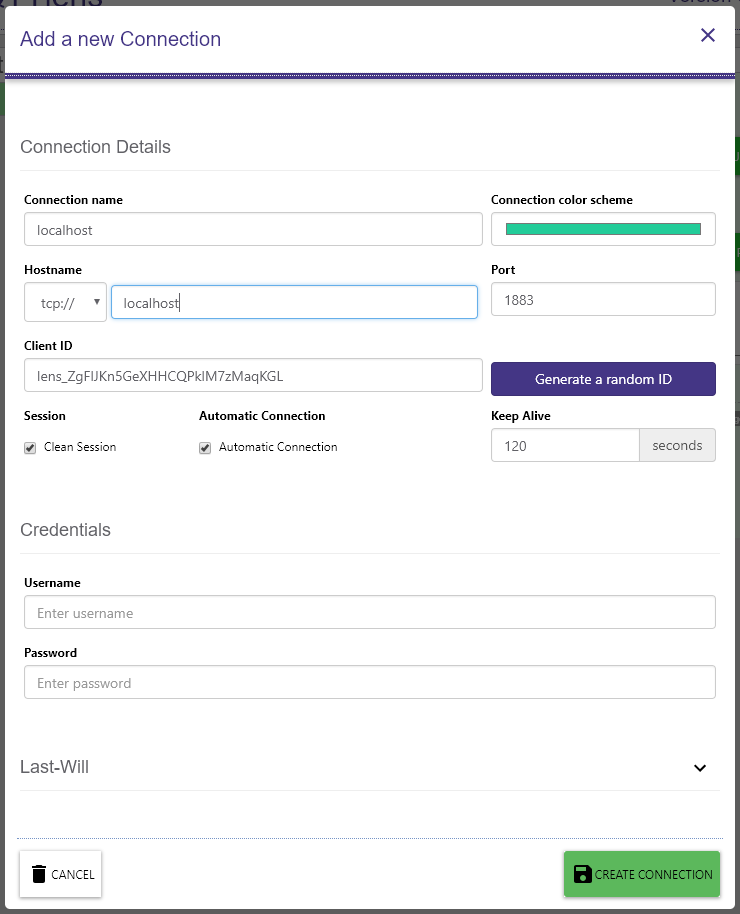
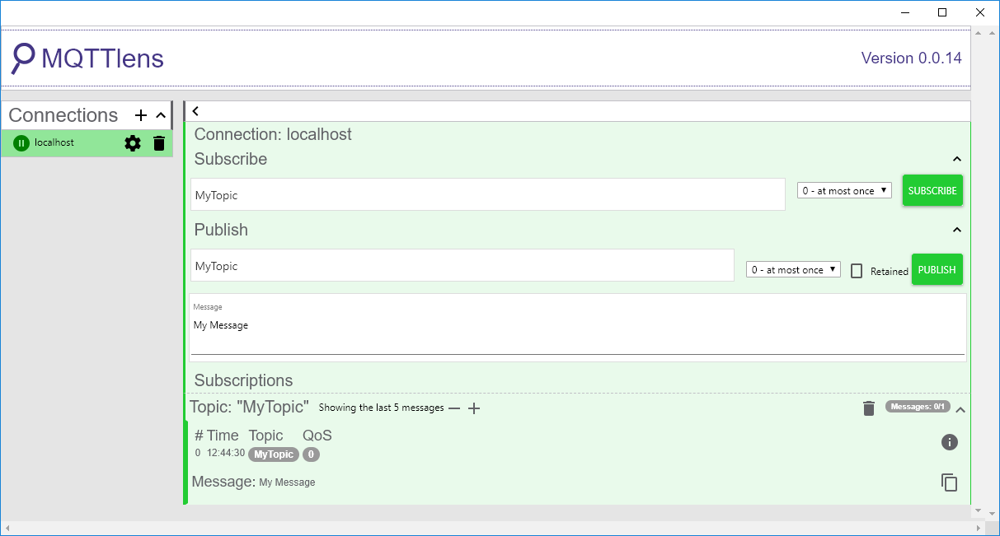
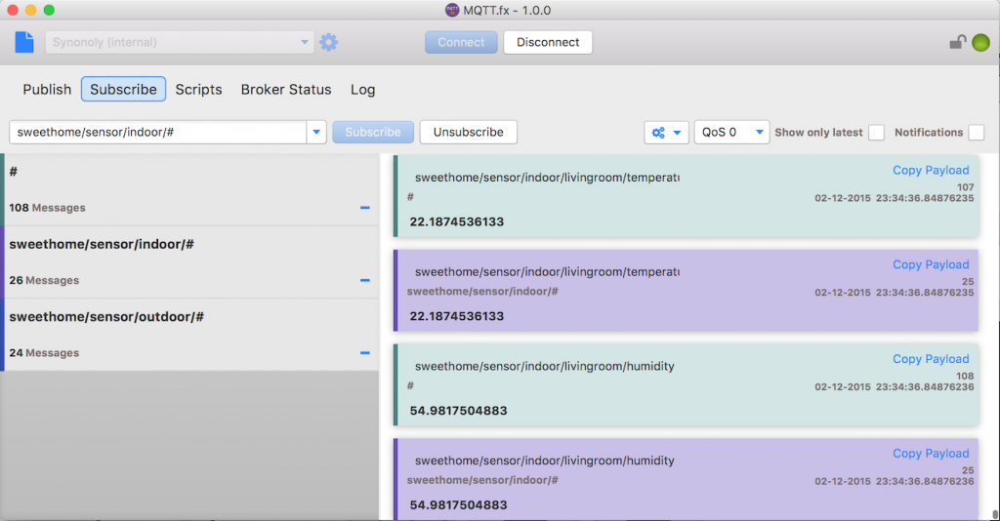

4.1. Лабораторная работа. Знакомимся с протоколом MQTT
=====================

4.1.1. Что такое MQTT и зачем он нужен?
-----------------------------------
В настоящий момент MQTT - один из двух самых распространенных протоколов прикладного уровня, используемых в Интернете вещей (второй протокол - это CoAP). Практически все известные облачные платформы IoT так или иначе имеют интерфейс MQTT.
Немного о самом протоколе и его истории. Он был разработан в 1999 году для систем транспортировки нефти: передачи данных от различных сенсоров в SCADA-систему в реальном времени. Его основные характеристики - простота, открытость, легковесность (не загружает канал связи). В те времена стоимость связи была гораздо выше, чем сейчас, и это предопределило особенности протокола MQTT.
Интересно, что изначально название протокола расшифровывалось как Message Queue Telemetry Transport. Однако это вносило путаницу, поскольку в MQTT используется другой паттерн: "Издатель/Подписчик" (Publisher/Subscriber), а не "Очередь сообщений" (Message Queue). Поэтому от расшифровки отказались, и на данный момент MQ в названии официально ничего не значит.
### MQTT в иерархии протоколов
Место протокола MQTT в сетевой модели TCP/IP находится на самом верхнем уровне, прикладном.
Важно, что в своей канонической реализации MQTT ниже уровнем предполагает использование TCP в качестве транспортного протокола. Это делает его несколько тяжелым для использования в сетях низкопотребляющих устройств, где важен каждый переданный байт. Существует реализация MQTT-SN для сенсорных сетей, в которой уровнем ниже находится UDP.
### Устройство MQTT
MQTT работает по модели "Издатель/подписчик", Что делает MQTT интересным для нас протоколом? Если говорить языком книги Эндрю Ханта и Дэвида Томаса "Программист-прагматик", он позволяет нам соблюдать принцип ортогональности, то есть строить программу как набор слабо связанных между собой сущностей.

Данная статья может быть полезна при изучении MQTT: https://ipc2u.ru/articles/prostye-resheniya/chto-takoe-mqtt/

4.1.2. Установка mosquitto
---------
На этом практикуме предстоит подробно изучить протокол MQTT. Для уверенной работы с ним стоит проделать несколько упражнений.
Сервер Mosquitto - лишь один из возможных вариантов сервера. Можно использовать и другие: HiveMQTT, HBMQTT. Но мы будем использовать Mosquitto, поскольку это самый популярный Open Source-сервер.
Установите себе на компьютер mosquitto. Это сервер, который можно запустить локально и потренироваться на нём. Установка на Ubuntu делается просто:
```C
sudo apt-get install mosquitto
```
Можно даже установить mosquitto в Windows, просто скачав дистрибутив с сайта. Тогда он появится в “Службах” Windows, и его можно будет запускать и останавливать из этого окна:

После этого необходимо зайти в Командную строку Windows и прописать там:
```C
cd [абсолютный путь до папки с mosquitto]
```

После этого мы попадаем в папку с самой программой и для запуска сервера необходимо ввести:
```C
masquitto.exe -v
```
После этого возможны 2 варианта: 
1) Сервер запустится и начнет свою работу. 
2) Вам выдаст ошибку о закрытом порте
Во втором случае необходимо запустить сервер на другом порте:
```C
mosquitto.exe -v -p [номер порта]
```
Например:
```C
mosquitto.exe -v -p 1900
```

Для более полного понимания процесса настройки сервера изучите данную статью: http://onreader.mdl.ru/MQTTProgrammingWithPython/content/Ch01.html

4.1.3. Hello World в mosquitto
------
### 1.Подписка на топик
В окне терминала введите команду подписки на топик:
```C
mosquitto.exe mosquitto_sub -h "localhost" -t "mytopic" -q 1
```
В качестве хоста указан localhost (то есть сам компьютер), а в качестве топика — вымышленный mytopic
Результат: программа будет ждать сообщений из этого топика.
### 2. Отправка сообщения
Наконец, в третьем окне терминала введите команду, отправляющую сообщение — mosquitto_pub:
```C
mosquitto.exe mosquitto_pub -h "localhost" -t "mytopic" -m "Hello World" -q 1
```
Параметры следующие:

-h — Адрес сервера

-t —  Название топика, в котором публикуется сообщение (в данном примере это mytopic)

-m — Текст сообщения

-q — Качество обслуживания

В результате, вы увидите в окне с подпиской текст «Hello World»

###  Качество обслуживания в протоколе MQTT (QoS)
MQTT поддерживает три уровня качества обслуживания (QoS) при передаче сообщений. 
1. *QoS 0 At most once.* На этом уровне издатель один раз отправляет сообщение брокеру и не ждет подтверждения от него, то есть отправил и забыл.<br/>


2. *QoS 1 At least once.* Этот уровень гарантирует, что сообщение точно будет доставлено брокеру, но есть вероятность дублирования сообщений от издателя. После получения дубликата сообщения, брокер снова рассылает это сообщение подписчикам, а издателю снова отправляет подтверждение о получении сообщения. Если издатель не получил PUBACK сообщения от брокера, он повторно отправляет этот пакет, при этом в DUP устанавливается «1».


3. *QoS 2 Exactly once.* На этом уровне гарантируется доставка сообщений подписчику и исключается возможное дублирование отправленных сообщений.


Издатель отправляет сообщение брокеру. В этом сообщении указывается уникальный Packet ID, QoS=2 и DUP=0. Издатель хранит сообщение неподтвержденным пока не получит от брокера ответ PUBREC. Брокер отвечает сообщением PUBREC в котором содержится тот же Packet ID. После его получения издатель отправляет PUBREL с тем же Packet ID. До того, как брокер получит PUBREL он должен хранить копию сообщения у себя. После получения PUBREL он удаляет копию сообщения и отправляет издателю сообщение PUBCOMP о том, что транзакция завершена.

**Защита передачи данных**
Для обеспечения безопасности в MQTT протоколе реализованы следующие методы защиты:

Аутентификация клиентов.
* Пакет CONNECT может содержать в себе поля USERNAME и PASSWORD. 
* При реализации брокера можно использовать эти поля для аутентификации клиента
* Контроль доступа клиентов через Client ID
* Подключение к брокеру через TLS/SSL

4.1.4. Графические клиенты
----------
### Расширение для браузера MQTTLens
Простой способ проверить работу сервера и увидеть вывод прямо в браузере — установить расширение MQTTLens для браузера Chrome. Установите его на своем компьютере.
Войдите в расширение и добавьте новое соединение. Для подключения к серверу достаточно знать IP-адрес, порт, логин и пароль. Hostname — введите IP-адрес компьютера, где запущен сервер, порт — 1883, и логин с паролем. Хостом может быть как локальный, так и удаленный сервер.


Попробуйте посмотреть в этом расширении вывод сообщений MQTT:


### MQTT.fx
Есть программа и с более широким функционалом. Она называется MQTT.fx и в ряде случаев незаменима. Программа написана на Java, её интерфейс довольно приятен.
Ознакомьтесь с ней самостоятельно. Принцип работы схож с MQTTLens. Благодаря большому набору различных опций, эта программа может выручить и помочь найти проблему в сложной ситуации - например, когда не получается подключиться к внешнему MQTT-серверу, используя сторонние библиотеки (о них далее).


