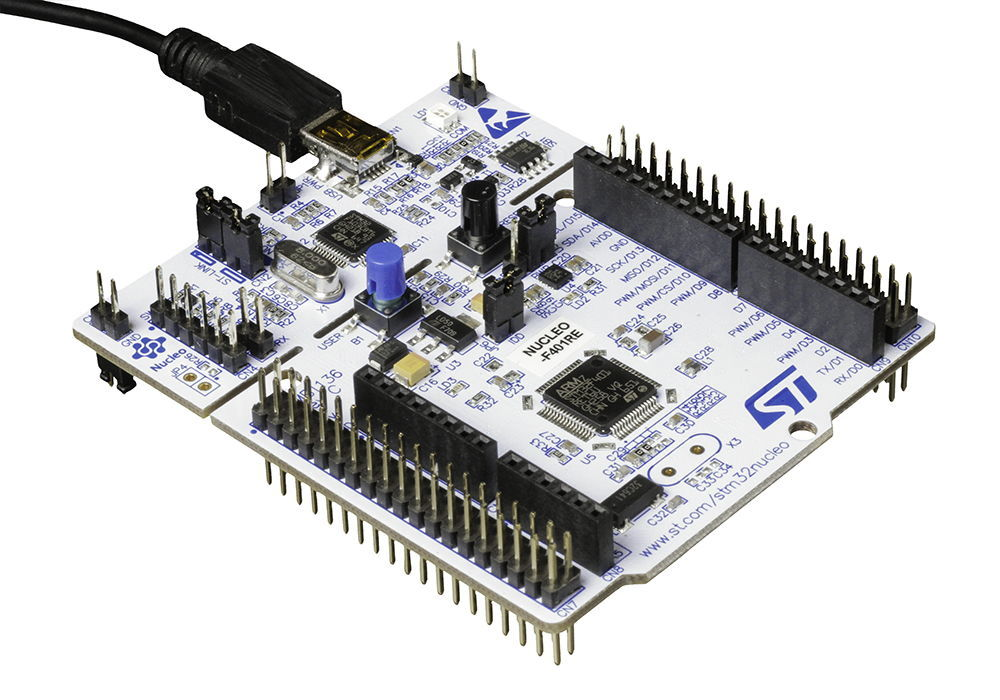

 ### Лабораторная работа 4.3. MQTT в Mbed
**Цель работы:** требуется написать программу, выполняющую подключение к MQTT серверу, используя Wi-Fi модуль, и получить данные в Mbed Studio.

### Ход работы
В примере рассматривается плата STM32 Nucleo и Wi-Fi модуль X Nucleo IDW01M1.


Плата STM32 Nucleo


Wi-Fi модуль X Nucleo IDW01M1, одетый на плату.

Для работы взяли готовый проект из лабораторной работы 3.2, полноценно подключающийся к Wi-Fi.


Также в проект была импортирована библиотека mbed-mqtt.


Далее был вставлен код из примера, но он был частично модернизирован, так как он был рассчитан только на 3 сообщения из топика, а именно теперь программа может принимать бесконечное число сообщений из топика.

Mbed_app.json:
```
{
    "config": {
        "wifi-ssid": {
            "help": "WiFi SSID",
            "value": "\"SSID\""
        },
        "wifi-password": {
            "help": "WiFi Password",
            "value": "\"PASSWORD\""
        }
    },
    "target_overrides": {
        "*": {
            "platform.stdio-convert-newlines": true,
            "idw0xx1.expansion-board": "IDW01M1",
            "idw0xx1.provide-default": true,
            "idw0xx1.tx": "PA_9",
            "idw0xx1.rx": "PA_10",
            "drivers.uart-serial-txbuf-size": 512,
            "drivers.uart-serial-rxbuf-size": 512
        }
    }
}
```

main.cpp:
```C++
#include "mbed.h"
#include "SpwfSAInterface.h"
#include "BlockExecuter.h"
#include "MQTTmbed.h"
#include "MQTTClientMbedOs.h"

WiFiInterface *wifi;

const char *sec2str(nsapi_security_t sec)
{
    switch (sec) {
        case NSAPI_SECURITY_NONE:
            return "None";
        case NSAPI_SECURITY_WEP:
            return "WEP";
        case NSAPI_SECURITY_WPA:
            return "WPA";
        case NSAPI_SECURITY_WPA2:
            return "WPA2";
        case NSAPI_SECURITY_WPA_WPA2:
            return "WPA/WPA2";
        case NSAPI_SECURITY_UNKNOWN:
        default:
            return "Unknown";
    }
}

int arrivedcount = 0;
 
void messageArrived(MQTT::MessageData& md)
{
    MQTT::Message &message = md.message;
    printf("Message arrived: qos %d, retained %d, dup %d, packetid %d\r\n", message.qos, message.retained, message.dup, message.id);
    printf("Payload %.*s\r\n", message.payloadlen, (char*)message.payload);
    ++arrivedcount;
}
 
void mqtt_demo(NetworkInterface *net)
{
    float version = 0.6;
    char* topic = "mbed-sample";
 
    TCPSocket socket;
    MQTTClient client(&socket);
 
    SocketAddress a;
    char* hostname = "192.168.0.11";
    net->gethostbyname(hostname, &a);
    int port = 1883;
    a.set_port(port);
 
    printf("Connecting to %s:%d\r\n", hostname, port);
 
    socket.open(net);
    printf("Opened socket\n\r");
    int rc = socket.connect(a);
    if (rc != 0)
        printf("rc from TCP connect is %d\r\n", rc);
    printf("Connected socket\n\r");
 
    MQTTPacket_connectData data = MQTTPacket_connectData_initializer;
    data.MQTTVersion = 3;
    data.clientID.cstring = "mbed-sample";
    data.username.cstring = "testuser";
    data.password.cstring = "testpassword";
    if ((rc = client.connect(data)) != 0)
        printf("rc from MQTT connect is %d\r\n", rc);
 
    if ((rc = client.subscribe(topic, MQTT::QOS2, messageArrived)) != 0)
        printf("rc from MQTT subscribe is %d\r\n", rc);
 
    MQTT::Message message;
 
    // QoS 0
    char buf[100];
    sprintf(buf, "Hello World!  QoS 0 message from app version %f\r\n", version);
    message.qos = MQTT::QOS0;
    message.retained = false;
    message.dup = false;
    message.payload = (void*)buf;
    message.payloadlen = strlen(buf)+1;
    rc = client.publish(topic, message);
    while (arrivedcount < 1)
        client.yield(100);
 
    // QoS 1
    sprintf(buf, "Hello World!  QoS 1 message from app version %f\r\n", version);
    message.qos = MQTT::QOS1;
    message.payloadlen = strlen(buf)+1;
    rc = client.publish(topic, message);
    while (arrivedcount != -1)
        client.yield(100);
 
    if ((rc = client.unsubscribe(topic)) != 0)
        printf("rc from unsubscribe was %d\r\n", rc);
 
    if ((rc = client.disconnect()) != 0)
        printf("rc from disconnect was %d\r\n", rc);
 
    socket.close();
 
    printf("Version %.2f: finish %d msgs\r\n", version, arrivedcount);
 
    return;
}

int scan_demo(WiFiInterface *wifi)
{
    WiFiAccessPoint *ap;

    printf("Scan:\n");

    int count = wifi->scan(NULL,0);

    if (count <= 0) {
        printf("scan() failed with return value: %d\n", count);
        return 0;
    }

    /* Limit number of network arbitrary to 15 */
    count = count < 15 ? count : 15;

    ap = new WiFiAccessPoint[count];
    count = wifi->scan(ap, count);

    if (count <= 0) {
        printf("scan() failed with return value: %d\n", count);
        return 0;
    }

    for (int i = 0; i < count; i++) {
        printf("Network: %s secured: %s BSSID: %hhX:%hhX:%hhX:%hhx:%hhx:%hhx RSSI: %hhd Ch: %hhd\n", ap[i].get_ssid(),
               sec2str(ap[i].get_security()), ap[i].get_bssid()[0], ap[i].get_bssid()[1], ap[i].get_bssid()[2],
               ap[i].get_bssid()[3], ap[i].get_bssid()[4], ap[i].get_bssid()[5], ap[i].get_rssi(), ap[i].get_channel());
    }
    printf("%d networks available.\n", count);

    delete[] ap;
    return count;
}

int main()
{
    printf("WiFi example\n");

#ifdef MBED_MAJOR_VERSION
    printf("Mbed OS version %d.%d.%d\n\n", MBED_MAJOR_VERSION, MBED_MINOR_VERSION, MBED_PATCH_VERSION);
#endif

    wifi = WiFiInterface::get_default_instance();
    if (!wifi) {
        printf("ERROR: No WiFiInterface found.\n");
        return -1;
    }

    int count = scan_demo(wifi);
    if (count == 0) {
        printf("No WIFI APs found - can't continue further.\n");
        return -1;
    }

    printf("\nConnecting to %s...\n", MBED_CONF_APP_WIFI_SSID);
    int ret = wifi->connect(MBED_CONF_APP_WIFI_SSID, MBED_CONF_APP_WIFI_PASSWORD, NSAPI_SECURITY_WPA_WPA2);
    if (ret != 0) {
        printf("\nConnection error: %d\n", ret);
        return -1;
    }

    printf("Success\n\n");
    printf("MAC: %s\n", wifi->get_mac_address());
    printf("IP: %s\n", wifi->get_ip_address());
    printf("Netmask: %s\n", wifi->get_netmask());
    printf("Gateway: %s\n", wifi->get_gateway());
    printf("RSSI: %d\n\n", wifi->get_rssi());

    mqtt_demo(wifi);

    wifi->disconnect();

    printf("\nDone\n");
}
```

### Вывод
Программа работает и выполняет поставленную задачу.