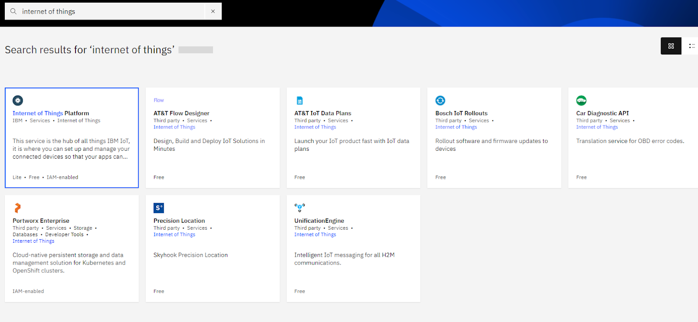
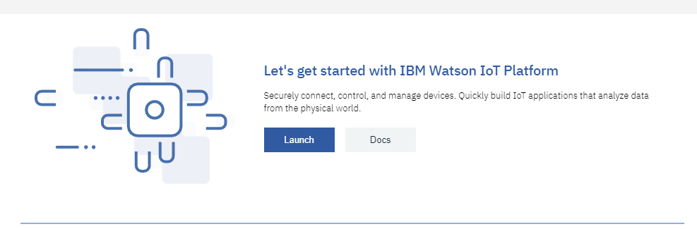
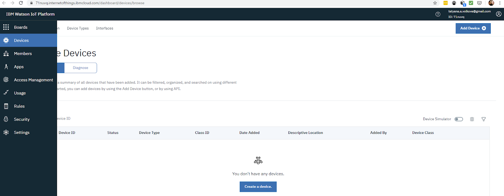
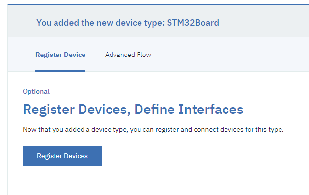
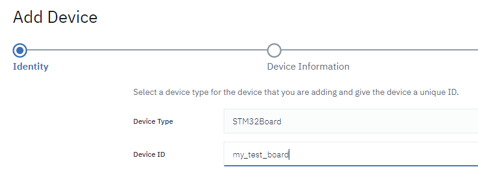
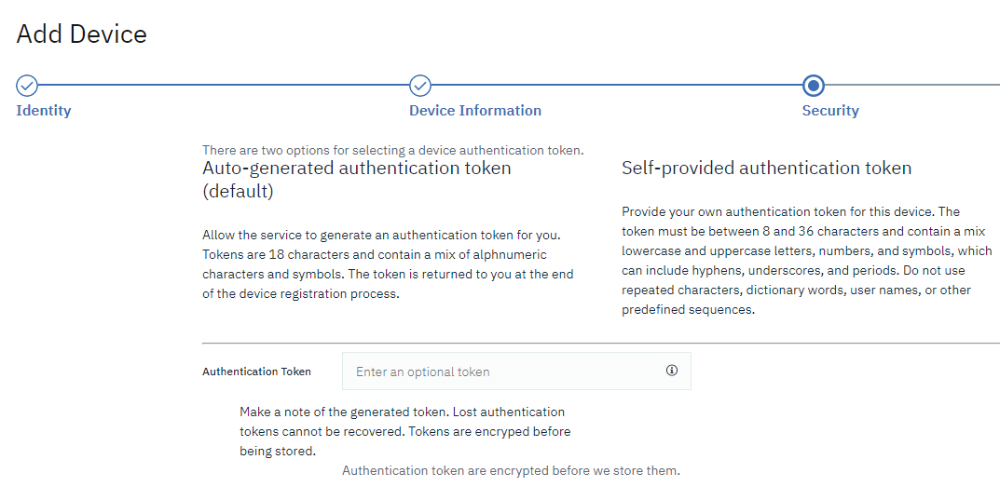
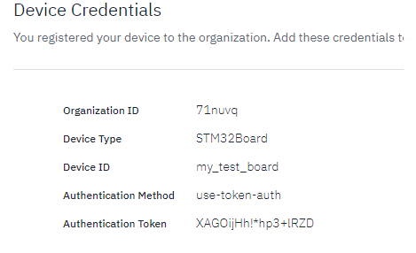
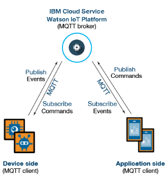
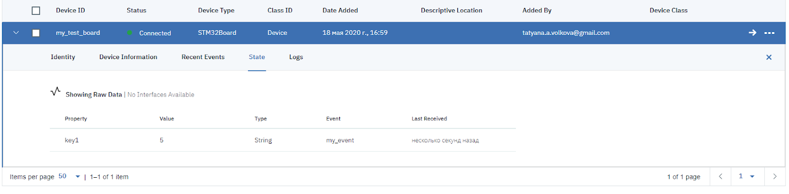
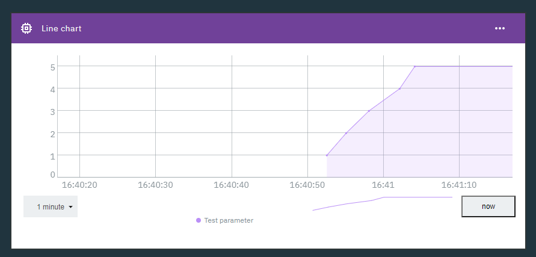

# 5.2 Лабораторная работа: Начинаем работу с Wi-Fi модулем
## Цель работы
Требуется создать и зарегистрировать виртуальное устройство, соединиться с собственным виртуальным устройством по MQTT.
## 5.2.1 Регистрация и создание устройства

Регистрация в IBM Cloud(https://www.ibm.com/ru-ru/cloud)

Затем переход по ссылке(https://cloud.ibm.com/catalog)

Нам необходм только пункт Internet of Things:

 



Нажать кнопку Create.(Кнопка Create позволяет подключать устройства Интернета вещей)

Важное условие при подклчении устройств
------
* не более 500 штук

* не более 200 Мб памяти на каждое

Нажать кнопку Launch!



Появится экран вашей панели управления устройствами Интернета вещей:



Адрес этой панели это фактическое название новосозданной организации в терминах IBM Cloud. Название организации выдается случаным образом, есть возможность задать свое имя. 

Далее необходимо создать новое устройство:

* Нажать Create a device

* Указать тип устройства

* Указать идентификатор устройства


Так как работа осуществляется с виртуальным устройством во вкладке Device Types пишем свой тип устройства, к примеру STM32Board. Далее в следующем окне указываем версию прошивки, производительность и прочее(можно не заполнять).


После успешного добавления устройства появляется возможность зарегистрировать новое устройство:

* нажать кнопку Regiter Devices



Результат:
 


Далее необходимо сгенерировать аутентификационный ключ:


Важно!
-------
* использовать автоматическую генерацию ключа
 

Важно!
-------
* Сохранть ключ (в данном примере XAGOijHh!*hp3+lRZD) в надежное место. 
* После закрытия сеанса браузера с этой страницей, вы больше никогда не увидите этого ключа.

## 5.2.2 Коммуникация с устройством - симуляция данных

На рисунке снизу изображена схема коммуникации между устройствами через протокол MQTT.
 
 
Используя графический клиент MQTT.fx, создаётся подключение к виртуальному устройству, предварительно зарегистрировав его. Тип устройства – STM32Board.

Ключ был сгенерирован автоматически.

 
 
Для проверки работоспособности отправляем сообщение от устройства. Для этого мы прописываем имя топика,идентификатор события и формат сообщения, который будет использоваться в формировании сообщения. Имя топика будет такое:
```C

iot-2/evt/my_event/fmt/json
```

А сообщение в формате JSON: {"key1": "5"}

Далее создаётся график с данными key от 1 до 5 в разделе Dashboard:
 

Итак, для создания собственного устройства необходимо: 
1. Зарегистрироваться в IBM Cloud
2. Создать ресурс IBM IOT.
3. В панели управления IBM IOT создать тип устройства. Запомнить название.
4. В панели управления IBM IOT создать устройство заданного типа и запомнить название и token
5. В панели управления IBM IOT создать приложение, запомнить API key и token.
6. В настройках "Защита"(Security) - "Защита соединений" уровень защиты "Необязательный" TLS(TLS Optional).
7. Пример программы по отправке данных с устройства:

```Python
import json
import time
import paho.mqtt.client as mqtt

device_token = "IFMfqzwib-Q3JL8FF0"
use_token_auth = "use-token-auth"
org_id = "aev2o9"
app_id = "iotlab17122020"
device_type = "simple_device_type"
device_name = "simple_device_1"

client = mqtt.Client('d:{}:{}:{}'.format(org_id, device_type, device_name))

client.username_pw_set(use_token_auth, device_token)
result = client.connect('{}.messaging.internetofthings.ibmcloud.com'.format(org_id), 1883, 60)
temp = 20
try:
    while (True):
        payload = {'d': {'temperature': temp}}
        temp = 1 if temp % 900 == 0 else temp + 1
        res = client.publish('iot-2/evt/statusEvent/fmt/json', json.dumps(payload))
        print('published temperature {} {}'.format(temp, res))
        time.sleep(1)
except:
    client.disconnect()
    print('interrupted')

# https://www.ibm.com/support/knowledgecenter/SSQP8H/iot/platform/applications/mqtt.html
```


В этом примере мы передаём параметр температуры.Для отображения данных нам необходимо дополнительно создать в Dashboard линейный график (Line Chart) в параметрах которого выбираем наше устройство, далее указываем параметры Event(в нашем случае это statusEvent), Property(если все выполнено верно, параметр temperature появится в предложенных), Name(Любое имя) и тип данных, в нашем случае это Числа. 

Результатом выполнения данных действий должен стать график изменения температуры. 


