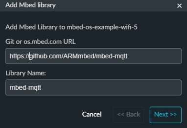

<<<<<<< HEAD
# Описание порядка выполнения работ по курсу IoT
=======
 ### Лабораторная работа 4.3. MQTT в Mbed
**Цель работы:** требуется написать программу, выполняющую подключение к MQTT серверу, используя Wi-Fi модуль, и получить данные в Mbed Studio.

### Ход работы
В примере рассматривается плата STM32 Nucleo и Wi-Fi модуль X Nucleo IDW01M1.


Плата STM32 Nucleo


Wi-Fi модуль X Nucleo IDW01M1, одетый на плату.

В качестве заготовки для лабораторной работы код был взят из л.р. 3.2, полноценно подключающийся к Wi-Fi.


Также в проект была импортирована библиотека mbed-mqtt.


Далее был вставлен код из примера, но он был частично модернизирован, так как он был рассчитан только на 3 сообщения из топика, а именно теперь программа может принимать бесконечное число сообщений из топика.

main.cpp (old):
```C++
	void mqtt_demo(NetworkInterface *net)
	{
	...
		while (arrivedcount < 2) // 2 сообщение
			client.yield(100);
	 
		while (arrivedcount < 3) // 3 сообщение
			client.yield(100);
	...
	}
```

main.cpp (new):
```C++
	void mqtt_demo(NetworkInterface *net)
	{
	...
		while (arrivedcount != -1) // Бесконечный цикл под бесконечное количество сообщений
			client.yield(100);
	...
	}
```
>>>>>>> 5312a991d2f09503414f263bcc65dbafaadc1c96
